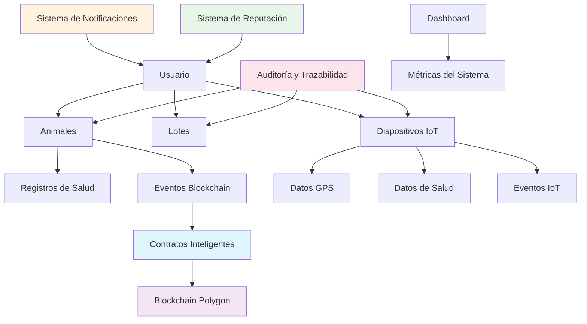
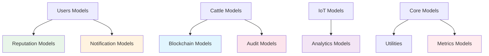

🎯 Beneficios de las Mejoras

    Mayor transparencia: Sistema de reputación y auditoría mejorada

    Mejor rendimiento: Índices optimizados y modelos más eficientes

    Experiencia de usuario: Sistema de notificaciones y dashboard

    Seguridad reforzada: Validaciones mejoradas y gestión granular de roles

    Escalabilidad: Estructura preparada para crecimiento

📅 Plan de Implementación

    Fase 1: Implementar mejoras de rendimiento y validaciones

    Fase 2: Añadir sistema de notificaciones y auditoría

    Fase 3: Implementar sistema de reputación y dashboard

    Fase 4: Optimización final y pruebas de carga

Estas mejoras convertirían el sistema en una plataforma más robusta, escalable y user-friendly, manteniendo todas las ventajas de la tecnología blockchain para la trazabilidad ganadera.

📊 Estructura Final Mejorada

    Esta organización mantiene una separación clara de responsabilidades, facilita el mantenimiento y permite escalar el sistema de manera modular. Cada archivo tiene una función específica y relacionada, lo que mejora la legibilidad y el trabajo en equipo.

backend/
├── cattle/
│   ├── models.py              # Modelos principales de ganado
│   ├── blockchain_models.py   # Modelos extendidos de blockchain
│   └── audit_models.py        # Modelos de auditoría y trazabilidad
├── iot/
│   ├── models.py              # Modelos principales de IoT
│   └── analytics_models.py    # Modelos analíticos de IoT
├── users/
│   ├── models.py              # Modelos principales de usuarios
│   ├── reputation_models.py   # Modelos de reputación y roles
│   └── notification_models.py # Modelos de notificaciones
└── core/
    ├── models.py              # Modelos transversales del sistema
    └── metrics_models.py      # Modelos de métricas y dashboard

