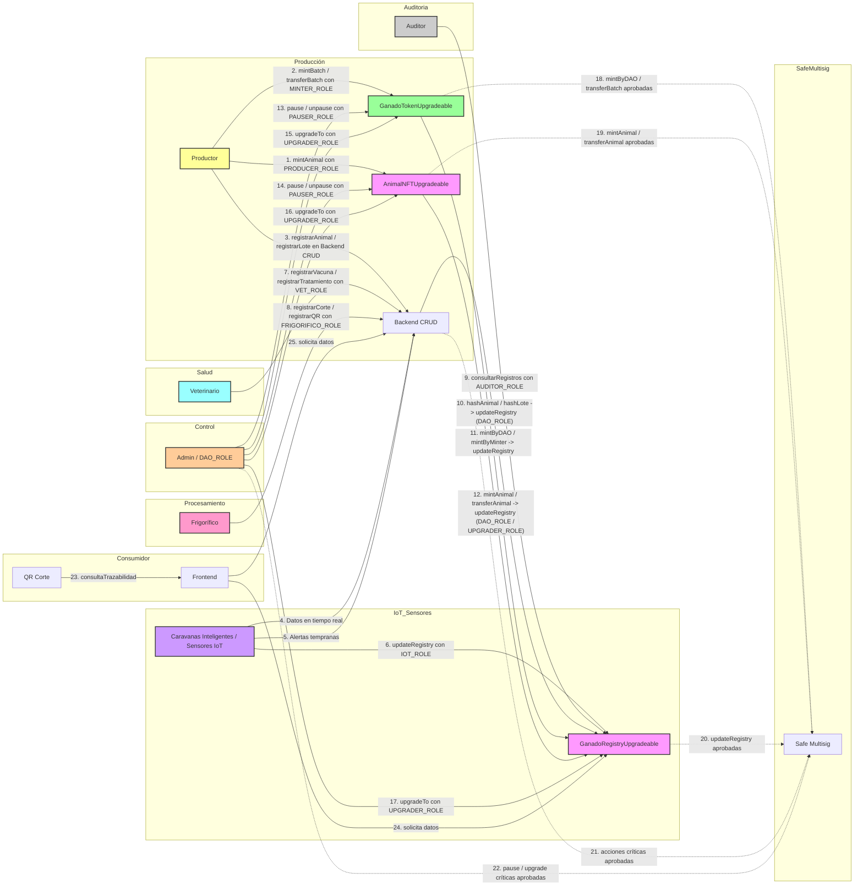

1. Descripción de clases y actores
Producción

Productor (P1)

Actor humano con PRODUCER_ROLE.

Registra animales individualmente (NFTs) y lotes (ERC20) en la blockchain.

También interactúa con el backend para CRUD de animales y lotes.

Responsable de la trazabilidad inicial.

AnimalNFTUpgradeable (NFT)

Smart contract que representa cada animal con un NFT único.

Permite mint, transferencia y actualización de estado.

Controlado por roles como PRODUCER_ROLE, DAO_ROLE, UPGRADER_ROLE.

GanadoTokenUpgradeable (ERC20)

Smart contract tipo ERC20 para representar lotes de ganado.

Soporta emisión (mintBatch) y transferencias en grupo.

Administrado por MINTER_ROLE y DAO_ROLE.

Backend CRUD

Aplicación fuera de la blockchain.

Guarda registros administrativos (animales, lotes, vacunas, cortes, etc.).

Se sincroniza con la blockchain vía updateRegistry.

IoT y Sensores

Caravanas Inteligentes / Sensores IoT

Dispositivos físicos que generan datos en tiempo real: ubicación, temperatura, movimiento.

Reportan alertas tempranas (ej. enfermedades).

Envían datos al Backend y pueden actualizar la blockchain con IOT_ROLE.

GanadoRegistryUpgradeable (Registry)

Smart contract que guarda los hashes de trazabilidad.

Recibe actualizaciones del Backend, IoT y otros actores mediante distintos roles (DAO_ROLE, IOT_ROLE, VET_ROLE, etc.).

Salud

Veterinario (Vet)

Actor con VET_ROLE.

Registra tratamientos, vacunas y diagnósticos en el Backend.

Estos datos se sincronizan al Registry para garantizar trazabilidad sanitaria.

Procesamiento

Frigorífico (Frio)

Actor con FRIGORIFICO_ROLE.

Registra cortes, empaques y genera QR de trazabilidad.

Todo se sube al Backend y se vincula al Registry.

Auditoría

Auditor

Actor con AUDITOR_ROLE.

Solo puede consultar registros en el Registry, sin modificarlos.

Función clave para transparencia e inspecciones regulatorias.

Control y Gobernanza

Admin / DAO

Usuario con DAO_ROLE y privilegios especiales.

Puede pausar contratos (PAUSER_ROLE) o actualizarlos (UPGRADER_ROLE).

Gestiona upgrades y asegura continuidad del sistema.

Safe Multisig

Bóveda de seguridad (multifirma).

Todas las operaciones críticas (mint, transferencias, upgrades, actualizaciones) pasan por aprobación multisig.

Evita acciones unilaterales riesgosas.

Consumidor Final

QR de Corte

Código QR generado en el proceso de faena.

El consumidor lo escanea para ver la trazabilidad del producto.

Frontend

Aplicación web/móvil para consumidores.

Consulta datos tanto en el Registry (on-chain) como en el Backend (off-chain).

```mermaid
erDiagram
    %% ================================
    %% USERS (users/models.py)
    %% ================================
    USER {
        bigint id
        string username
        string email
        string password
        boolean is_active
        datetime date_joined
    }

    USER_ACTIVITY_LOG {
        bigint id
        bigint user_id
        string action
        text details
        string ip_address
        datetime timestamp
    }

    USER_PREFERENCE {
        bigint id
        bigint user_id
        boolean email_notifications
        boolean push_notifications
        string language
    }

    API_TOKEN {
        bigint id
        bigint user_id
        string name
        string key
        datetime created_at
        datetime expires_at
        boolean is_active
    }

    %% ================================
    %% USERS/REPUTATION
    %% ================================
    USER_ROLE {
        bigint id
        bigint user_id
        string role_type
        string scope_type
        string scope_id
        bigint granted_by
        datetime granted_at
        datetime expires_at
        boolean is_active
    }

    REPUTATION_SCORE {
        bigint id
        bigint user_id
        string reputation_type
        decimal score
        int total_actions
        int positive_actions
        datetime last_calculated
        json metrics
    }

    %% ================================
    %% USERS/NOTIFICATIONS
    %% ================================
    NOTIFICATION {
        bigint id
        bigint user_id
        string notification_type
        string title
        text message
        string related_object_id
        string related_content_type
        boolean is_read
        string priority
        datetime created_at
    }

    %% ================================
    %% CATTLE (cattle/models.py)
    %% ================================
    ANIMAL {
        bigint id
        string ear_tag
        string breed
        date birth_date
        string sex
        string status
        datetime created_at
        datetime updated_at
    }

    ANIMAL_HEALTH_RECORD {
        bigint id
        bigint animal_id
        string health_status
        string treatment
        string veterinarian
        datetime recorded_at
    }

    BATCH {
        bigint id
        string name
        string description
        datetime created_at
    }

    %% ================================
    %% CATTLE/BLOCKCHAIN
    %% ================================
    BLOCKCHAIN_EVENT_STATE {
        bigint id
        bigint event_id
        string state
        int confirmation_blocks
        bigint block_confirmed
        datetime created_at
        datetime updated_at
    }

    %% ================================
    %% CATTLE/AUDIT
    %% ================================
    CATTLE_AUDIT_TRAIL {
        bigint id
        string object_type
        string object_id
        string action_type
        bigint user_id
        json previous_state
        json new_state
        json changes
        string ip_address
        string blockchain_tx_hash
        datetime timestamp
    }

    %% ================================
    %% IOT (iot/models.py)
    %% ================================
    IOT_DEVICE {
        bigint id
        string device_id
        string device_type
        string status
        datetime registered_at
    }

    GPS_DATA {
        bigint id
        bigint device_id
        float latitude
        float longitude
        datetime timestamp
    }

    HEALTH_SENSOR_DATA {
        bigint id
        bigint device_id
        float temperature
        float heart_rate
        float movement
        datetime timestamp
    }

    DEVICE_EVENT {
        bigint id
        bigint device_id
        string event_type
        json payload
        datetime timestamp
    }

    DEVICE_CONFIGURATION {
        bigint id
        bigint device_id
        int sampling_interval
        int transmission_power
        float battery_threshold
        datetime updated_at
    }

    %% ================================
    %% IOT/ANALYTICS
    %% ================================
    DEVICE_ANALYTICS {
        bigint id
        bigint device_id
        date date
        int total_readings
        float avg_battery_level
        float connectivity_uptime
        float data_quality_score
        int alerts_triggered
        datetime created_at
    }

    %% ================================
    %% BLOCKCHAIN (blockchain/models.py)
    %% ================================
    BLOCKCHAIN_EVENT {
        bigint id
        string event_type
        string transaction_hash
        datetime block_timestamp
    }

    CONTRACT_INTERACTION {
        bigint id
        string contract_type
        string method
        json parameters
        datetime called_at
    }

    NETWORK_STATE {
        bigint id
        string network_name
        int chain_id
        boolean is_active
        datetime updated_at
    }

    SMART_CONTRACT {
        bigint id
        string name
        string address
        string version
    }

    GAS_PRICE_HISTORY {
        bigint id
        int gas_price
        datetime timestamp
    }

    TRANSACTION_POOL {
        bigint id
        string transaction_hash
        string status
        datetime created_at
    }

    %% ================================
    %% CORE/METRICS
    %% ================================
    SYSTEM_METRICS {
        bigint id
        date date
        int total_animals
        int total_users
        int total_transactions
        int active_devices
        float average_gas_price
        int blockchain_events
        int health_alerts
        int producer_count
        int vet_count
        int frigorifico_count
        int auditor_count
        float avg_response_time
        float error_rate
        float system_uptime
        datetime created_at
    }

    %% ================================
    %% RELACIONES
    %% ================================
    USER ||--o{ USER_ACTIVITY_LOG : performs
    USER ||--|| USER_PREFERENCE : has
    USER ||--o{ API_TOKEN : has
    USER ||--o{ USER_ROLE : has_roles
    USER ||--o{ REPUTATION_SCORE : reputation
    USER ||--o{ NOTIFICATION : notified
    USER ||--o{ CATTLE_AUDIT_TRAIL : actions

    ANIMAL ||--o{ ANIMAL_HEALTH_RECORD : health
    ANIMAL }o--o{ BATCH : grouped
    ANIMAL ||--o{ IOT_DEVICE : monitored

    IOT_DEVICE ||--o{ GPS_DATA : generates
    IOT_DEVICE ||--o{ HEALTH_SENSOR_DATA : generates
    IOT_DEVICE ||--o{ DEVICE_EVENT : events
    IOT_DEVICE ||--|| DEVICE_CONFIGURATION : configured
    IOT_DEVICE ||--o{ DEVICE_ANALYTICS : metrics

    BLOCKCHAIN_EVENT ||--|| BLOCKCHAIN_EVENT_STATE : state
    CONTRACT_INTERACTION }|--|| SMART_CONTRACT : interacts



```



1. Diagrama Completo (con marcos de clases y sin errores de ciclo)

2. Diagrama simplificado para presentación

```mermaid
flowchart LR
    P1[Productor] --> NFT[AnimalNFT]
    P1 --> ERC20[GanadoToken]
    P1 --> Backend[Backend]

    IoT[IoT Sensores] --> Backend
    IoT --> Registry[GanadoRegistry]

    Vet[Veterinario] --> Backend
    Frio[Frigorífico] --> Backend
    Auditor[Auditor] --> Registry

    Backend --> Registry
    ERC20 --> Registry
    NFT --> Registry

    Admin[Admin/DAO] --> ERC20
    Admin --> NFT
    Admin --> Registry

    Safe[Safe Multisig] -.-> ERC20
    Safe -.-> NFT
    Safe -.-> Registry
    Safe -.-> Backend
    Safe -.-> Admin

    QR[QR Corte] --> Frontend[Frontend]
    Frontend --> Registry
    Frontend --> Backend

