1. Descripción de clases y actores
Producción

Productor (P1)

Actor humano con PRODUCER_ROLE.

Registra animales individualmente (NFTs) y lotes (ERC20) en la blockchain.

También interactúa con el backend para CRUD de animales y lotes.

Responsable de la trazabilidad inicial.

AnimalNFTUpgradeable (NFT)

Smart contract que representa cada animal con un NFT único.

Permite mint, transferencia y actualización de estado.

Controlado por roles como PRODUCER_ROLE, DAO_ROLE, UPGRADER_ROLE.

GanadoTokenUpgradeable (ERC20)

Smart contract tipo ERC20 para representar lotes de ganado.

Soporta emisión (mintBatch) y transferencias en grupo.

Administrado por MINTER_ROLE y DAO_ROLE.

Backend CRUD

Aplicación fuera de la blockchain.

Guarda registros administrativos (animales, lotes, vacunas, cortes, etc.).

Se sincroniza con la blockchain vía updateRegistry.

IoT y Sensores

Caravanas Inteligentes / Sensores IoT

Dispositivos físicos que generan datos en tiempo real: ubicación, temperatura, movimiento.

Reportan alertas tempranas (ej. enfermedades).

Envían datos al Backend y pueden actualizar la blockchain con IOT_ROLE.

GanadoRegistryUpgradeable (Registry)

Smart contract que guarda los hashes de trazabilidad.

Recibe actualizaciones del Backend, IoT y otros actores mediante distintos roles (DAO_ROLE, IOT_ROLE, VET_ROLE, etc.).

Salud

Veterinario (Vet)

Actor con VET_ROLE.

Registra tratamientos, vacunas y diagnósticos en el Backend.

Estos datos se sincronizan al Registry para garantizar trazabilidad sanitaria.

Procesamiento

Frigorífico (Frio)

Actor con FRIGORIFICO_ROLE.

Registra cortes, empaques y genera QR de trazabilidad.

Todo se sube al Backend y se vincula al Registry.

Auditoría

Auditor

Actor con AUDITOR_ROLE.

Solo puede consultar registros en el Registry, sin modificarlos.

Función clave para transparencia e inspecciones regulatorias.

Control y Gobernanza

Admin / DAO

Usuario con DAO_ROLE y privilegios especiales.

Puede pausar contratos (PAUSER_ROLE) o actualizarlos (UPGRADER_ROLE).

Gestiona upgrades y asegura continuidad del sistema.

Safe Multisig

Bóveda de seguridad (multifirma).

Todas las operaciones críticas (mint, transferencias, upgrades, actualizaciones) pasan por aprobación multisig.

Evita acciones unilaterales riesgosas.

Consumidor Final

QR de Corte

Código QR generado en el proceso de faena.

El consumidor lo escanea para ver la trazabilidad del producto.

Frontend

Aplicación web/móvil para consumidores.

Consulta datos tanto en el Registry (on-chain) como en el Backend (off-chain).


1. Diagrama Completo (con marcos de clases y sin errores de ciclo)
```mermaid
flowchart LR
    %% Producción
    subgraph Producción
        P1[Productor] 
        P1 -->|"1. mintAnimal con PRODUCER_ROLE"| NFT[AnimalNFTUpgradeable]
        P1 -->|"2. mintBatch / transferBatch con MINTER_ROLE"| ERC20[GanadoTokenUpgradeable]
        P1 -->|"3. registrarAnimal / registrarLote en Backend CRUD"| Backend[Backend CRUD]
    end

    %% IoT y Sensores
    subgraph IoT_Sensores
        IoT[Caravanas Inteligentes / Sensores IoT] -->|"4. Datos en tiempo real"| Backend
        IoT -->|"5. Alertas tempranas"| Backend
        IoT -->|"6. updateRegistry con IOT_ROLE"| Registry[GanadoRegistryUpgradeable]
    end

    %% Salud
    subgraph Salud
        Vet[Veterinario] -->|"7. registrarVacuna / registrarTratamiento con VET_ROLE"| Backend
    end

    %% Procesamiento
    subgraph Procesamiento
        Frio[Frigorífico] -->|"8. registrarCorte / registrarQR con FRIGORIFICO_ROLE"| Backend
    end

    %% Auditoría
    subgraph Auditoria
        Auditor[Auditor] -->|"9. consultarRegistros con AUDITOR_ROLE"| Registry
    end

    %% Interacción con Registry
    Backend -->|"10. hashAnimal / hashLote -> updateRegistry (DAO_ROLE)"| Registry
    ERC20 -->|"11. mintByDAO / mintByMinter -> updateRegistry"| Registry
    NFT -->|"12. mintAnimal / transferAnimal -> updateRegistry (DAO_ROLE / UPGRADER_ROLE)"| Registry

    %% Control
    subgraph Control
        Admin[Admin / DAO_ROLE] 
        Admin -->|"13. pause / unpause con PAUSER_ROLE"| ERC20
        Admin -->|"14. pause / unpause con PAUSER_ROLE"| NFT
        Admin -->|"15. upgradeTo con UPGRADER_ROLE"| ERC20
        Admin -->|"16. upgradeTo con UPGRADER_ROLE"| NFT
        Admin -->|"17. upgradeTo con UPGRADER_ROLE"| Registry
    end

    %% Safe Multisig
    subgraph SafeMultisig
        Safe[Safe Multisig]
        ERC20 -.->|"18. mintByDAO / transferBatch aprobadas"| Safe
        NFT -.->|"19. mintAnimal / transferAnimal aprobadas"| Safe
        Registry -.->|"20. updateRegistry aprobadas"| Safe
        Backend -.->|"21. acciones críticas aprobadas"| Safe
        Admin -.->|"22. pause / upgrade críticas aprobadas"| Safe
    end

    %% Consumidor
    subgraph Consumidor
        QR[QR Corte] -->|"23. consultaTrazabilidad"| Frontend[Frontend]
        Frontend -->|"24. solicita datos"| Registry
        Frontend -->|"25. solicita datos"| Backend
    end

    %% Roles y estilo
    classDef dao fill:#f9f,stroke:#333,stroke-width:2px;
    classDef minter fill:#9f9,stroke:#333,stroke-width:2px;
    classDef producer fill:#ff9,stroke:#333,stroke-width:2px;
    classDef vet fill:#9ff,stroke:#333,stroke-width:2px;
    classDef frigorifico fill:#f9c,stroke:#333,stroke-width:2px;
    classDef auditor fill:#ccc,stroke:#333,stroke-width:2px;
    classDef admin fill:#fc9,stroke:#333,stroke-width:2px;
    classDef iot fill:#c9f,stroke:#333,stroke-width:2px;

    class ERC20,NFT,Registry dao;
    class ERC20 minter;
    class P1 producer;
    class Vet vet;
    class Frio frigorifico;
    class Auditor auditor;
    class Admin admin;
    class IoT iot;

```
2. Diagrama simplificado para presentación

```mermaid
flowchart LR
    P1[Productor] --> NFT[AnimalNFT]
    P1 --> ERC20[GanadoToken]
    P1 --> Backend[Backend]

    IoT[IoT Sensores] --> Backend
    IoT --> Registry[GanadoRegistry]

    Vet[Veterinario] --> Backend
    Frio[Frigorífico] --> Backend
    Auditor[Auditor] --> Registry

    Backend --> Registry
    ERC20 --> Registry
    NFT --> Registry

    Admin[Admin/DAO] --> ERC20
    Admin --> NFT
    Admin --> Registry

    Safe[Safe Multisig] -.-> ERC20
    Safe -.-> NFT
    Safe -.-> Registry
    Safe -.-> Backend
    Safe -.-> Admin

    QR[QR Corte] --> Frontend[Frontend]
    Frontend --> Registry
    Frontend --> Backend

```


1. Diagrama Completo con Emojis

```mermaid
    flowchart LR
    %% Producción
    subgraph Producción
        P1["👨‍🌾 Productor"] 
        P1 -->|"1. mintAnimal 🐄"| NFT["📦 AnimalNFTUpgradeable"]
        P1 -->|"2. mintBatch 💰"| ERC20["💵 GanadoTokenUpgradeable"]
        P1 -->|"3. CRUD Backend"| Backend["🖥️ Backend CRUD"]
    end

    %% IoT y Sensores
    subgraph IoT_Sensores
        IoT["📡 Caravanas IoT"] -->|"Datos en tiempo real 📊"| Backend
        IoT -->|"updateRegistry 🔐"| Registry["📑 GanadoRegistryUpgradeable"]
    end

    %% Salud
    subgraph Salud
        Vet["🧑‍⚕️ Veterinario"] -->|"Vacunas 💉"| Backend
    end

    %% Procesamiento
    subgraph Procesamiento
        Frio["🥩 Frigorífico"] -->|"Registrar Corte 🔪"| Backend
    end

    %% Auditoría
    subgraph Auditoria
        Auditor["🔎 Auditor"] -->|"Consultar Registros 📜"| Registry
    end

    %% Interacción con Registry
    Backend -->|"hashAnimal 🐄 / hashLote 📦"| Registry
    ERC20 -->|"mintByDAO 🏛️"| Registry
    NFT -->|"transferAnimal ↔️"| Registry

    %% Control
    subgraph Control
        Admin["⚙️ Admin / DAO"] 
        Admin -->|"pause ⏸️ / unpause ▶️"| ERC20
        Admin -->|"pause ⏸️ / unpause ▶️"| NFT
        Admin -->|"upgradeTo 🔄"| Registry
    end

    %% Safe Multisig
    subgraph SafeMultisig
        Safe["🛡️ Safe Multisig"]
        ERC20 -.->|"Transacciones Seguras ✅"| Safe
        NFT -.->|"Transacciones Seguras ✅"| Safe
        Registry -.->|"Update Seguro 🔐"| Safe
        Backend -.->|"Operaciones críticas ⚠️"| Safe
        Admin -.->|"Upgrade seguro 🔄"| Safe
    end

    %% Consumidor
    subgraph Consumidor
        QR["📲 QR Corte"] -->|"Consulta Trazabilidad 🔍"| Frontend["🌐 Frontend"]
        Frontend --> Registry
        Frontend --> Backend
    end

```
2. Diagrama Simplificado con Emojis

```mermaid
flowchart LR
    P1["👨‍🌾 Productor"] --> NFT["📦 AnimalNFT"]
    P1 --> ERC20["💵 GanadoToken"]
    P1 --> Backend["🖥️ Backend"]

    IoT["📡 IoT Sensores"] --> Backend
    IoT --> Registry["📑 GanadoRegistry"]

    Vet["🧑‍⚕️ Veterinario"] --> Backend
    Frio["🥩 Frigorífico"] --> Backend
    Auditor["🔎 Auditor"] --> Registry

    Backend --> Registry
    ERC20 --> Registry
    NFT --> Registry

    Admin["⚙️ Admin/DAO"] --> ERC20
    Admin --> NFT
    Admin --> Registry

    Safe["🛡️ Safe Multisig"] -.-> ERC20
    Safe -.-> NFT
    Safe -.-> Registry
    Safe -.-> Backend
    Safe -.-> Admin

    QR["📲 QR Corte"] --> Frontend["🌐 Frontend"]
    Frontend --> Registry
    Frontend --> Backend



```


3. Diagrama Completo con recuadros
📋 Características del Diagrama:
✅ Organización por Archivos:

    Color-coded por archivo: Cada grupo de modelos está separado por su archivo de origen

    Estructura modular: Reflecta la estructura real del proyecto Django

✅ Modelos Completos:

    Todos los campos: Incluye todos los campos de cada modelo con sus tipos

    Relaciones completas: Todas las FK y relaciones many-to-many

    Constraints: PK, UK, y relaciones bien definidas

✅ Nuevos Modelos Incluidos:

    Users: UserRole, ReputationScore, Notification

    Cattle: BlockchainEventState, CattleAuditTrail

    IoT: DeviceAnalytics

    Core: SystemMetrics

✅ Relaciones Mejoradas:

    Relaciones de auditoría: User → CattleAuditTrail

    Relaciones de reputación: User → ReputationScore

    Relaciones de analytics: IoTDevice → DeviceAnalytics

    Relaciones de estado: BlockchainEvent → BlockchainEventState

✅ Formato Consistente:

    Misma sintaxis: Sigue el mismo formato que el diagrama original

    Orden lógico: Agrupado por funcionalidad y archivo

    Documentación clara: Comentarios que explican cada sección

Este diagrama representa completamente la estructura de la base de datos del sistema GanadoChain, mostrando todas las tablas, campos, relaciones y constraints de manera organizada y fácil de entender.

# 🐄 Sistema GanadoChain - Explicación Completa de Archivos y Clases
backend/
├── cattle/                          # 🐄 App principal de ganado
│   ├── models.py                    # Modelos principales
│   ├── blockchain_models.py         # Extensiones blockchain
│   ├── audit_models.py              # Auditoría y trazabilidad
│   └── admin.py                     # Administración Django
├── iot/                             # 📱 App de dispositivos IoT
│   ├── models.py                    # Modelos principales IoT
│   ├── analytics_models.py          # Analítica de dispositivos
│   └── admin.py                     # Administración IoT
├── users/                           # 👥 App de usuarios
│   ├── models.py                    # Modelos principales usuarios
│   ├── reputation_models.py         # Sistema de reputación
│   ├── notification_models.py       # Sistema de notificaciones
│   └── admin.py                     # Administración usuarios
├── blockchain/                      # ⛓️ App blockchain
│   ├── models.py                    # Modelos blockchain
│   └── admin.py                     # Administración blockchain
└── core/                            # 🧩 Utilidades transversales
    ├── models.py                    # Validadores y utilidades
    ├── metrics_models.py            # Métricas del sistema
    └── admin.py                     # Administración core

# 🐄 CATTLE - Módulo de Ganado
## 📄 cattle/models.py

### Modelos principales del sistema de ganado:

    Animal: Modelo central que representa un animal en el sistema

        ear_tag: Identificador único (arete)

        breed: Raza del animal

        health_status: Estado de salud (HEALTHY, SICK, etc.)

        token_id: ID del NFT asociado en blockchain

        mint_transaction_hash: Hash de la transacción de mint

        current_batch: Lote actual del animal

    AnimalHealthRecord: Registros de salud de los animales

        Historial de temperaturas, ritmo cardíaco, etc.

        Vinculación con dispositivos IoT

        Registros en blockchain

    Batch: Lotes de animales

        Agrupación de animales para transporte/processamiento

        Trazabilidad completa del lote

        Metadata en IPFS

## 📄 cattle/blockchain_models.py

### Extensiones para blockchain:

    BlockchainEventState: Estado extendido de eventos blockchain

        Seguimiento de confirmaciones (PENDING, CONFIRMED, FAILED, REVERTED)

        Número de bloques de confirmación

        Auditoría de estados de transacciones

## 📄 cattle/audit_models.py

### Sistema de auditoría:

    CattleAuditTrail: Auditoría completa de cambios

        Registro de todas las operaciones (CREATE, UPDATE, DELETE)

        Snapshots de estados anteriores y nuevos

        Vinculación con transacciones blockchain

# 📱 IOT - Módulo de Dispositivos IoT
## 📄 iot/models.py

### Dispositivos y datos IoT:

    IoTDevice: Dispositivos de monitoreo

        device_type: Tipo (TEMPERATURE, GPS, HEART_RATE, etc.)

        status: Estado (ACTIVE, INACTIVE, MAINTENANCE)

        battery_level: Nivel de batería

        Vinculación con animal y usuario

    GPSData: Datos de geolocalización

        Coordenadas, altitud, precisión

        Velocidad y dirección

        Timestamps de dispositivo

    HealthSensorData: Datos de salud

        Ritmo cardíaco, temperatura, movimiento

        Tiempo de rumia, alimentación

        Alertas automáticas de salud

    DeviceEvent: Eventos de dispositivos

        Conexiones, desconexiones, errores

        Alertas de batería, mantenimiento

    DeviceConfiguration: Configuración de dispositivos

        Intervalos de muestreo

        Umbrales de alerta

        Configuración de funcionalidades

## 📄 iot/analytics_models.py

### Analítica de dispositivos:

    DeviceAnalytics: Métricas de rendimiento

        Total de lecturas por día

        Promedio de batería

        Porcentaje de conectividad

        Calidad de datos

# 👥 USERS - Módulo de Usuarios
## 📄 users/models.py

### Usuarios y actividad:

    User: Modelo extendido de usuario

        wallet_address: Dirección Ethereum del usuario

        role: Rol en el sistema (PRODUCER, VET, FRIGORIFICO, etc.)

        blockchain_roles: Roles en contratos inteligentes

        Sistema de verificación en blockchain

    UserActivityLog: Registro de actividad

        Login, logout, operaciones blockchain

        Metadata de sesiones

        Vinculación con transacciones

    UserPreference: Preferencias de usuario

        Configuración de notificaciones

        Preferencias de interfaz

    APIToken: Tokens de API

        Para integraciones externas

        Tipos de permisos (READ, WRITE, ADMIN, IOT)

## 📄 users/reputation_models.py

### Sistema de reputación:

    UserRole: Roles granulares

        Roles con scope específico (global, lote, animal, ubicación)

        Tiempo de expiración

        Usuario que otorgó el rol

    ReputationScore: Puntuación de reputación

        Por tipo de usuario (PRODUCER, VET, FRIGORIFICO, AUDITOR)

        Métricas específicas por tipo

        Historial de acciones

## 📄 users/notification_models.py

### Sistema de notificaciones:

    Notification: Notificaciones a usuarios

        Tipos: HEALTH_ALERT, BLOCKCHAIN_TX, IOT_ALERT, etc.

        Prioridades (LOW, MEDIUM, HIGH, URGENT)

        Objetos relacionados (animales, lotes, registros)

# ⛓️ BLOCKCHAIN - Módulo Blockchain
## 📄 blockchain/models.py

### Operaciones blockchain:

    BlockchainEvent: Eventos de blockchain

        Tipos: MINT, TRANSFER, ROLE_ADD, HEALTH_UPDATE, etc.

        Vinculación con animales y lotes

        Metadata de transacciones

    ContractInteraction: Interacciones con contratos

        Llamadas a funciones de contratos

        Consumo de gas y costos

        Estados de transacciones

    SmartContract: Contratos desplegados

        Información de addresses y ABI

        Versiones y configuración

        Contratos upgradeables

    NetworkState: Estado de la red

        Último bloque sincronizado

        Precio de gas promedio

        Nodos activos

    GasPriceHistory: Historial de precios de gas

        Para análisis y optimización

    TransactionPool: Pool de transacciones pendientes

        Reintentos automáticos

        Estados de procesamiento

# 🧩 CORE - Módulo Transversal
## 📄 core/models.py

### Utilidades y validadores:

    Validadores:

        validate_ethereum_address(): Validación completa de addresses

        validate_transaction_hash(): Validación de hashes

        validate_ipfs_hash(): Validación de hashes IPFS

## 📄 core/metrics_models.py

### Métricas del sistema:

    SystemMetrics: Dashboard del sistema

        Total de animales, usuarios, transacciones

        Métricas de rendimiento

        Estado de la red y dispositivos

        Tasas de error y disponibilidad

# 🔗 Relaciones Principales del Sistema
## Flujo de Trazabilidad Completa:

    Usuario (PRODUCER) crea un Animal 🐄

    Dispositivos IoT 📱 monitorean al animal

    Datos de salud 📊 se registran automáticamente

    Eventos blockchain ⛓️ registran operaciones

    Lotes 📦 agrupan animales para transporte

    Auditoría 📝 registra todos los cambios

    Reputación ⭐ se calcula basado en acciones

    Notificaciones 🔔 alertan eventos importantes

## Integración Blockchain:

    Minting de NFTs: Cada animal tiene un NFT único

    Tokens de utilidad: Sistema de recompensas

    Governance: DAO para toma de decisiones

    Oracles: Datos IoT en blockchain

## Seguridad y Auditoría:

    Validación completa de addresses y hashes

    Registro inmutable de todas las operaciones

    Sistema de roles granular con permisos específicos

    Auditoría completa con snapshots de datos


# 🎯 Beneficios del Sistema
## Para Productores:

    Trazabilidad completa desde nacimiento hasta consumidor

    Automatización con dispositivos IoT

    Mayor valor mediante NFTs verificados

## Para Consumidores:

    Transparencia total del origen de la carne

    Verificación blockchain de calidad

    Historial completo del animal

## Para la Industria:

    Reducción de fraudes y errores

    Optimización de procesos

    Datos analíticos para mejoras

Este sistema representa una solución completa de trazabilidad ganadera que combina tecnología IoT, blockchain y analítica avanzada para crear un ecosistema transparente, eficiente y confiable.

```mermaid

erDiagram
    %% ================================
    %% USERS (users/models.py)
    %% ================================
    USER {
        bigint id
        string username
        string email
        string password
        boolean is_active
        datetime date_joined
    }

    USER_ACTIVITY_LOG {
        bigint id
        bigint user_id
        string action
        text details
        string ip_address
        datetime timestamp
    }

    USER_PREFERENCE {
        bigint id
        bigint user_id
        boolean email_notifications
        boolean push_notifications
        string language
    }

    API_TOKEN {
        bigint id
        bigint user_id
        string name
        string key
        datetime created_at
        datetime expires_at
        boolean is_active
    }

    USER_ROLE {
        bigint id
        bigint user_id
        string role_type
        string scope_type
        string scope_id
        bigint granted_by
        datetime granted_at
        datetime expires_at
        boolean is_active
    }

    REPUTATION_SCORE {
        bigint id
        bigint user_id
        string reputation_type
        decimal score
        int total_actions
        int positive_actions
        datetime last_calculated
        json metrics
    }

    NOTIFICATION {
        bigint id
        bigint user_id
        string notification_type
        string title
        text message
        string related_object_id
        string related_content_type
        boolean is_read
        string priority
        datetime created_at
    }

    %% ================================
    %% CATTLE (cattle/models.py)
    %% ================================
    ANIMAL {
        bigint id
        string ear_tag
        string breed
        date birth_date
        string sex
        string status
        datetime created_at
        datetime updated_at
    }

    ANIMAL_HEALTH_RECORD {
        bigint id
        bigint animal_id
        string health_status
        string treatment
        string veterinarian
        datetime recorded_at
    }

    BATCH {
        bigint id
        string name
        string description
        datetime created_at
    }

    BLOCKCHAIN_EVENT_STATE {
        bigint id
        bigint event_id
        string state
        int confirmation_blocks
        bigint block_confirmed
        datetime created_at
        datetime updated_at
    }

    CATTLE_AUDIT_TRAIL {
        bigint id
        string object_type
        string object_id
        string action_type
        bigint user_id
        json previous_state
        json new_state
        json changes
        string ip_address
        string blockchain_tx_hash
        datetime timestamp
    }

    %% ================================
    %% IOT (iot/models.py)
    %% ================================
    IOT_DEVICE {
        bigint id
        string device_id
        string device_type
        string status
        datetime registered_at
    }

    GPS_DATA {
        bigint id
        bigint device_id
        float latitude
        float longitude
        datetime timestamp
    }

    HEALTH_SENSOR_DATA {
        bigint id
        bigint device_id
        float temperature
        float heart_rate
        float movement
        datetime timestamp
    }

    DEVICE_EVENT {
        bigint id
        bigint device_id
        string event_type
        json payload
        datetime timestamp
    }

    DEVICE_CONFIGURATION {
        bigint id
        bigint device_id
        int sampling_interval
        int transmission_power
        float battery_threshold
        datetime updated_at
    }

    DEVICE_ANALYTICS {
        bigint id
        bigint device_id
        date date
        int total_readings
        float avg_battery_level
        float connectivity_uptime
        float data_quality_score
        int alerts_triggered
        datetime created_at
    }

    %% ================================
    %% BLOCKCHAIN (blockchain/models.py)
    %% ================================
    BLOCKCHAIN_EVENT {
        bigint id
        string event_type
        string transaction_hash
        datetime block_timestamp
    }

    CONTRACT_INTERACTION {
        bigint id
        string contract_type
        string method
        json parameters
        datetime called_at
    }

    NETWORK_STATE {
        bigint id
        string network_name
        int chain_id
        boolean is_active
        datetime updated_at
    }

    SMART_CONTRACT {
        bigint id
        string name
        string address
        string version
    }

    GAS_PRICE_HISTORY {
        bigint id
        int gas_price
        datetime timestamp
    }

    TRANSACTION_POOL {
        bigint id
        string transaction_hash
        string status
        datetime created_at
    }

    %% ================================
    %% CORE/METRICS
    %% ================================
    SYSTEM_METRICS {
        bigint id
        date date
        int total_animals
        int total_users
        int total_transactions
        int active_devices
        float average_gas_price
        int blockchain_events
        int health_alerts
        int producer_count
        int vet_count
        int frigorifico_count
        int auditor_count
        float avg_response_time
        float error_rate
        float system_uptime
        datetime created_at
    }

    %% ================================
    %% RELACIONES
    %% ================================
    USER ||--o{ USER_ACTIVITY_LOG : performs
    USER ||--|| USER_PREFERENCE : has
    USER ||--o{ API_TOKEN : has
    USER ||--o{ USER_ROLE : has_roles
    USER ||--o{ REPUTATION_SCORE : reputation
    USER ||--o{ NOTIFICATION : notified
    USER ||--o{ CATTLE_AUDIT_TRAIL : actions

    ANIMAL ||--o{ ANIMAL_HEALTH_RECORD : health
    ANIMAL }o--o{ BATCH : grouped
    ANIMAL ||--o{ IOT_DEVICE : monitored

    IOT_DEVICE ||--o{ GPS_DATA : generates
    IOT_DEVICE ||--o{ HEALTH_SENSOR_DATA : generates
    IOT_DEVICE ||--o{ DEVICE_EVENT : events
    IOT_DEVICE ||--|| DEVICE_CONFIGURATION : configured
    IOT_DEVICE ||--o{ DEVICE_ANALYTICS : metrics

    BLOCKCHAIN_EVENT ||--|| BLOCKCHAIN_EVENT_STATE : state
    CONTRACT_INTERACTION }|--|| SMART_CONTRACT : interacts


    %% ================================
    %% COLORES POR ARCHIVO
    %% ================================
    style USER fill:#e6f2ff,stroke:#1a75ff,stroke-width:2px
    style USER_ACTIVITY_LOG fill:#e6f2ff,stroke:#1a75ff,stroke-width:2px
    style USER_PREFERENCE fill:#e6f2ff,stroke:#1a75ff,stroke-width:2px
    style API_TOKEN fill:#e6f2ff,stroke:#1a75ff,stroke-width:2px
    style USER_ROLE fill:#e6f2ff,stroke:#1a75ff,stroke-width:2px
    style REPUTATION_SCORE fill:#e6f2ff,stroke:#1a75ff,stroke-width:2px
    style NOTIFICATION fill:#e6f2ff,stroke:#1a75ff,stroke-width:2px

    style ANIMAL fill:#e6ffe6,stroke:#33cc33,stroke-width:2px
    style ANIMAL_HEALTH_RECORD fill:#e6ffe6,stroke:#33cc33,stroke-width:2px
    style BATCH fill:#e6ffe6,stroke:#33cc33,stroke-width:2px
    style BLOCKCHAIN_EVENT_STATE fill:#e6ffe6,stroke:#33cc33,stroke-width:2px
    style CATTLE_AUDIT_TRAIL fill:#e6ffe6,stroke:#33cc33,stroke-width:2px

    style IOT_DEVICE fill:#fff0e6,stroke:#ff6600,stroke-width:2px
    style GPS_DATA fill:#fff0e6,stroke:#ff6600,stroke-width:2px
    style HEALTH_SENSOR_DATA fill:#fff0e6,stroke:#ff6600,stroke-width:2px
    style DEVICE_EVENT fill:#fff0e6,stroke:#ff6600,stroke-width:2px
    style DEVICE_CONFIGURATION fill:#fff0e6,stroke:#ff6600,stroke-width:2px
    style DEVICE_ANALYTICS fill:#fff0e6,stroke:#ff6600,stroke-width:2px

    style BLOCKCHAIN_EVENT fill:#f9e6ff,stroke:#cc33ff,stroke-width:2px
    style CONTRACT_INTERACTION fill:#f9e6ff,stroke:#cc33ff,stroke-width:2px
    style NETWORK_STATE fill:#f9e6ff,stroke:#cc33ff,stroke-width:2px
    style SMART_CONTRACT fill:#f9e6ff,stroke:#cc33ff,stroke-width:2px
    style GAS_PRICE_HISTORY fill:#f9e6ff,stroke:#cc33ff,stroke-width:2px
    style TRANSACTION_POOL fill:#f9e6ff,stroke:#cc33ff,stroke-width:2px

    style SYSTEM_METRICS fill:#ffffe6,stroke:#cccc00,stroke-width:2px
